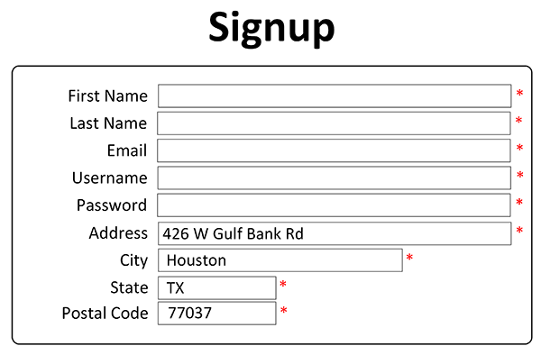
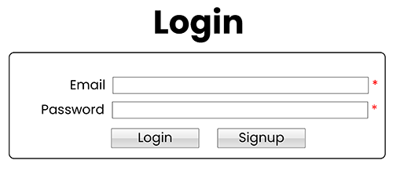
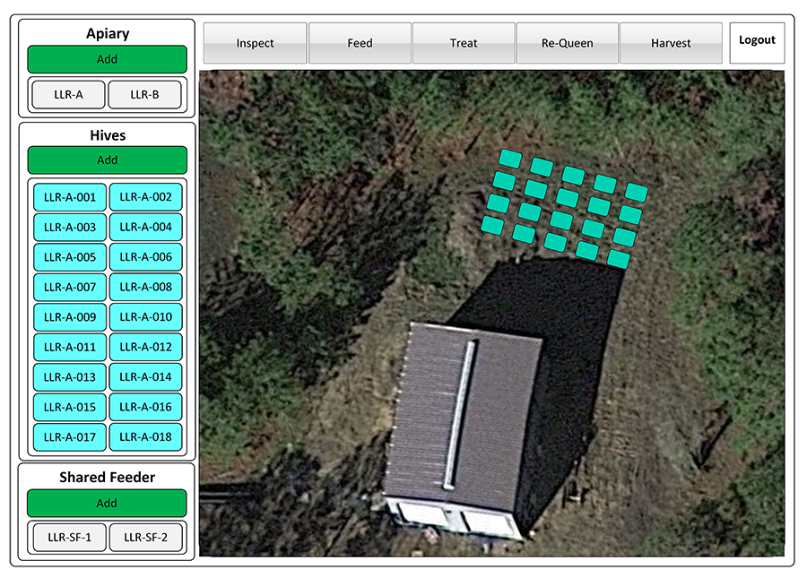
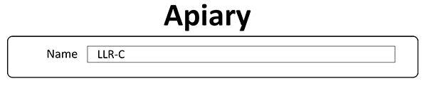
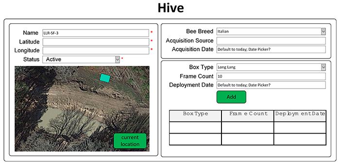
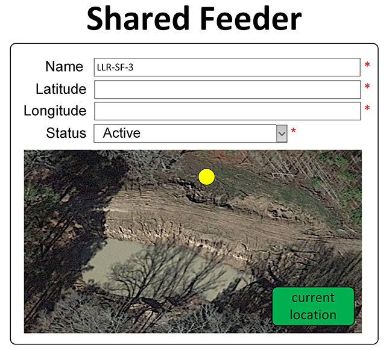

# [Hive Logistics](#title)

## [Description](#description)
Hive Logistics is a mobile-responsive, web application for managing hobbyist and commercial apiaries. Using geolocation, beekeepers can mark the location of individual hives and community feeders, and record activities, such as inspections, treatments, feedings, requeening, and harvesting honey. Hive Logistics will make your beekeeping more enjoyable and result in healthier, more productive honey bees.

## Table of Contents
> - [Title](#title)
> - [Description](#description)
> - [Developers](#developer)
> - [Packages & Libraries](#resources)
> - [Tech Stack](#stack)
> - [Wireframe](#wireframe)
> - [Minimum Viable Product](#MVP)

## [Developers](#developer)
1. Maria Jayakumar
2. Jamie Jackson
3. Brad Kelley

## [Packages & Libraries](#resources)
The following resources were used in the development of this project.

> - Apollo Server Express (version ^3.6.7)
> - Bcrypt (version ^5.0.1)
> - Dotenv (version ^16.0.0)
> - Express (version ^4.17.3)
> - Express Session (version ^1.17.2)
> - Google Maps React (version ^2.1.10)
> - Graphql (version ^15.5.0)
> - Jsonwebtoken (version ^8.5.1)
> - MongoDB Atlas (cloud version ^5.0.6)
> - Mongoose (version ^6.2.9)
> - Node.js (version ^16.14.2)
> - React (version ^17.0.2)
> - React Dom (version ^17.0.2)
> - React Scripts (version ^5.0.0)
> - Web Vitals (version ^1.1.1)

## [Tech Stack](#stack)
> - HTML 5
> - JavaScript
> - CSS

## [Wireframe](#wireframe)
### User Signup

### User Login

### Main Screen

### Apiary Record

### Hive Record

### Feeder Record

## [Minimum Viable Product](#MVP)
The MVP for the proposed application is as follows:

Upon application launch the user will be presented with a **Login** screen. Only authenticated users will have access to the application's features & functions.

**Create an Account & Login**
1. When the user clicks on the **Login** hyperlink in the upper right corner of the viewable screen, then the user is presented with an application **login form** that includes a link to **signup**.

2. When the user clicks on the **signup** link, then the user is presented a **signup form** that includes the user’s first and last name, username, email, postal address, and password.

3. When the user has successfully completed the **signup form** form and clicks the **signup button**, then the user-provided information is validated; if the information passes the validation checks, an account is created and the application returns the user to the **login form**; else the application provide an error message.

4. When the user enters a registered **email address** and **password** into the **login form** and clicks the **login button**, then the application verifies the user’s credentials; if the user has valid credentials, the application will (1. Issue a cookie to the user’s browser, (2. Log the user’s session in the application’s database, and (3. Redirect the user to the **main screen**.

**Main Screen**
As the name suggests, the **main screen** is the primary user interface from which the application user is able to manage apiaries, hives, shared feeders, and perform actions. Additionally, the **main screen** includes a geospatial canvas (Google Maps) that is used to visualize the location of **hives** and **shared feeders** within an **apiary**. The geospatial canvas is particularly useful in managing apiaries with multiple hives and feeders dispersed over a large area.

**Apiary**
Apiaries are most frequently a geographic area in which honey bee hives and community feeders are located. All hives defined within an apiary belong to that apiary. Only apiaries belonging to a user account can be viewed managed by that user.

5. When a user clicks on the **Add button** within the Apiary section on the main screen, then the user will be presented with a form to create an apiary. The **Apiary form** will include a freeform text box to enter the apiary's name.

6. When a user clicks on an **Apiary Record** on the main screen, then the user will be presented with apiary's details from the MongoDB database. From this screen the user can read the record's details, as well as use buttons on the form to save changes and delete the record.

**Hive**
A **hive** is defined within an **Apiary**. Only hives that belong to an apiary are shown on the main screen. Moreover, only apiaries and hives belonging to a user account can be viewed managed by that user. 

7. When a user clicks on the **Add button** within the Hive section on the main screen, then the user will be presented with a form to create a hive. The **Hive form** will include fields to define the hive's **name, latitude, longitude, status, bee breed, acquisition source, and acquisition date**. Additionally, application users can define information about the hive boxes. To capture the hive's **latitude & longitude** the user will have the option to manually enter the information or click on the **current location button**.

8. When a user clicks on the **current location button**, then the application will attempt to use the user's geolocation service. The user will be prompted to allow access to their device's location services. If access is granted, then the application will provide the user's current **latitude & longitude**. Note that the user's device must have GPS hardware and be used outside to properly access geolocation satellite services. 

9. When a user clicks on a **Hive Record** on the main screen, then the user will be presented with hive's details from the MongoDB database. From this screen the user can read the record's details, as well as use buttons on the form to save changes and delete the record.

**Shared Feeder**
A **Shared Feeder** is defined within an **Apiary**. Only shared feeders that belong to an apiary are shown on the main screen. Moreover, only apiaries and shared feeders belonging to a user account can be viewed managed by that user. 

10. When a user clicks on the **Add button** within the Shared Feeder section on the main screen, then the user will be presented with a form to create a hive. The **Shared Feeder form** will include fields to define the hive's **name, latitude, longitude, status**. To capture the hive's **latitude & longitude** the user will have the option to manually enter the information or click on the **current location button**.

11. When a user clicks on the **current location button**, then the application will attempt to use the user's geolocation service. The user will be prompted to allow access to their device's location services. If access is granted, then the application will provide the user's current **latitude & longitude**. Note that the user's device must have GPS hardware and be used outside to properly access geolocation satellite services. 

12. When a user clicks on a **Shared Feeder Record** on the main screen, then the user will be presented with hive's details from the MongoDB database. From this screen the user can read the record's details, as well as use buttons on the form to save changes and delete the record.

**Actions**
13. When a user clicks on a **hive** and an **action** (i.e., inspections, treatments, feedings, requeening, and harvesting honey), then the application will record the date on which the action was performed. A user can also view all actions performed on a hive.

## Stretch Goals
Project stretch goals include incorporating the following non-prioritized features:
1. Provide an inspection form
2. Provide forms for each action to provide details about the action event. For example, during a feeding, what type and how much food was provided?
3. Integrate and store weather conditions for an apiary.
